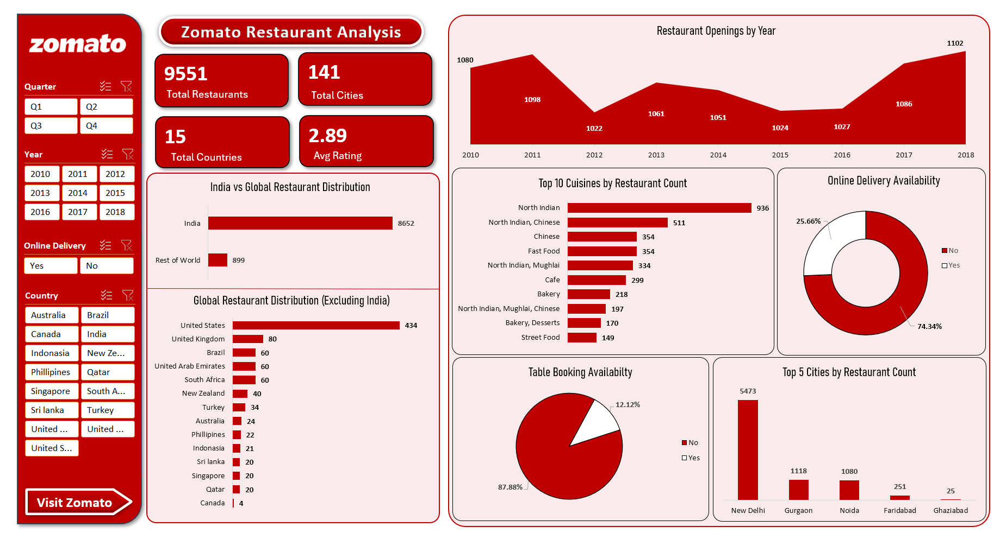

# 🍽️ Zomato Data Analysis — Excel

An Excel-based restaurant data analysis project developed as part of an end-to-end Zomato Data Analytics project.

The analysis focuses on restaurant distribution, restaurant opening trends, ratings, cuisines, pricing, table booking and online delivery availability.

---

## 📊 Dashboard Preview



---

## 🎯 Project Objective

The objective of this Excel analysis is to transform raw Zomato restaurant data into meaningful business insights using Microsoft Excel.

The analysis covers:

- Restaurant distribution across countries and cities
- Restaurant opening trends over time
- Restaurant ratings and rating categories
- Average cost for two in USD
- Table booking availability
- Online delivery availability
- Popular cuisines
- Top cities by restaurant count

---

## 🛠️ Tool Used

| Tool | Purpose |
|---|---|
| Microsoft Excel | Data cleaning, data modeling, analysis and dashboard development |

---

## 📁 Files

### Excel Analysis Workbook

[📊 Excel Zomato Final.xlsx](Excel%20Zomato%20Final.xlsx)

### Dashboard

The Excel dashboard is displayed above and is also available as:

[🖼️ Excel Dashboard](Excel_Dashboard.png)

---

## 📋 Analysis Performed

### 1. Data Modeling

Built a data model using the available sheets in the Excel dataset.

### 2. Calendar Table

Created a calendar table using the restaurant opening date information.

The calendar analysis includes:

- Year
- Month Number
- Month Full Name
- Quarter
- Year-Month
- Weekday Number
- Weekday Name
- Financial Month
- Financial Quarter

### 3. Currency Conversion

Converted the Average Cost for Two from local currencies into USD using the available currency information.

### 4. Restaurant Count Analysis

Analyzed the number of restaurants based on:

- City
- Country

### 5. Restaurant Opening Analysis

Analyzed restaurant openings by:

- Year
- Quarter
- Month

### 6. Restaurant Rating Analysis

Analyzed restaurant counts based on average ratings and rating categories.

### 7. Average Cost Buckets

Created price buckets based on the Average Cost for Two and analyzed the number of restaurants within each price range.

### 8. Table Booking Analysis

Analyzed the percentage of restaurants that provide table booking facilities.

### 9. Online Delivery Analysis

Analyzed the percentage of restaurants that provide online delivery.

### 10. Cuisine Analysis

Analyzed restaurant distribution based on cuisines and identified the most popular cuisines.

### 11. City Analysis

Analyzed restaurant concentration across cities and identified the top cities by restaurant count.

---

## 📈 Dashboard Visualizations

The Excel dashboard contains the following visualizations:

- Table Booking Percentage
- Restaurant Opening by Year
- Restaurants by Average Rating
- Online Delivery Percentage
- Top 5 Restaurants by City
- Top 10 Cuisines

---

## 🔎 Interactive Filters

The dashboard provides interactive filtering using:

- Year
- Country
- Restaurant Rating Bucket

These filters allow the analysis to be explored dynamically.

---

## 📊 Key Dashboard KPIs

The Excel dashboard highlights the following key metrics:

| KPI | Value |
|---|---:|
| Total Restaurants | 9,551 |
| Total Countries | 15 |
| Total Cities | 141 |
| Average Rating | 2.89 |
| Average Cost for Two (USD) | 10.09 |

---

## 💡 Key Insights

The Excel analysis provides a consolidated view of:

- Restaurant distribution across countries and cities
- Restaurant opening patterns over time
- Restaurant rating distribution
- Table booking availability
- Online delivery availability
- Popular cuisines
- Major restaurant cities
- Average restaurant pricing

---

## 🧩 Skills Demonstrated

- Data Cleaning
- Data Transformation
- Data Modeling
- Calendar Table Creation
- Currency Conversion
- Excel Formulas
- Pivot Tables
- Data Analysis
- Interactive Filters
- Dashboard Development
- Data Visualization
- Business Insights

---

## 📂 Project Structure

```text
Zomato-Data-Analytics
│
├── 01_Raw-Data
│   └── Zomato_Dataset.xlsx
│
├── 02_Excel
│   ├── Excel Zomato Final.xlsx
│   ├── Excel_Dashboard.png
│   └── README.md
│
├── 03_PowerBI
├── 04_SQL
├── 05_Tableau
│
└── README.md
